# ObserveOps — Production DevOps Observability Stack

## Project Overview

This project demonstrates a complete production-grade observability infrastructure deployed across three dedicated AWS EC2 instances using Jenkins, Flask, Prometheus, Loki, Grafana, Node Exporter, and Promtail.

The primary goal is to simulate how real engineering teams monitor, log, and alert on production systems — covering the full observability triangle: metrics, logs, and alerting.

This implementation includes:

- Jenkins CI/CD automation on a dedicated server
- Flask Python application with NGINX reverse proxy
- Prometheus metrics collection via Node Exporter
- Loki centralized log aggregation via Promtail
- Grafana dashboards for visualization
- Gmail SMTP email alerting
- Grafana alert rules for CPU, RAM, Disk, and Server Down
- All components running as systemd services
- AWS EC2 with Security Group configuration

---
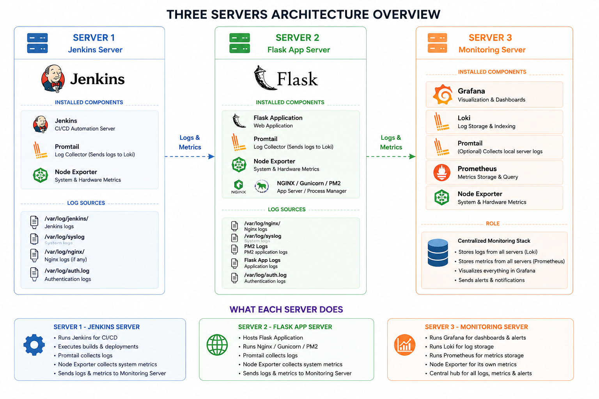.
## Final Architecture

```
Developer Pushes Code
        ↓
GitHub Repository
        ↓
Jenkins CI/CD Pipeline
        ↓
Flask App Deployed on Server 2
        ↓
Node Exporter exposes metrics
        ↓
Promtail ships logs
        ↓
Prometheus scrapes metrics → Server 3
        ↓
Loki receives logs → Server 3
        ↓
Grafana dashboards + alert rules
        ↓
Email notification on threshold breach
```

---

## Detailed Architecture Diagram

```
┌──────────────────────────────────────────┐
│               SERVER 1                   │
│             Jenkins Server               │
│                                          │
│  Jenkins        → CI/CD pipeline,        │
│                   GitHub integration,    │
│                   automated builds       │
│                   port 8080              │
│                                          │
│  Node Exporter  → collects CPU, RAM,     │
│                   disk, network metrics  │
│                   exposes port 9100      │
│                                          │
│  Promtail       → reads Jenkins logs     │
│                   pushes to Loki         │
│                   label: job=jenkins     │
└────────────────────┬─────────────────────┘
                     │  Logs + Metrics
                     ▼
┌──────────────────────────────────────────┐
│               SERVER 3                   │
│           Monitoring Server              │
│                                          │
│  Prometheus     → scrapes Node Exporter  │
│                   from Server 1 & 2      │
│                   stores metrics         │
│                   port 9090              │
│                                          │
│  Loki           → receives log streams   │
│                   from all Promtails     │
│                   stores logs            │
│                   port 3100              │
│                                          │
│  Grafana        → reads Prometheus + Loki│
│                   renders dashboards     │
│                   manages alert rules    │
│                   sends email alerts     │
│                   port 3000              │
└────────────────────▲─────────────────────┘
                     │  Logs + Metrics
┌────────────────────┴─────────────────────┐
│               SERVER 2                   │
│            Flask App Server              │
│                                          │
│  Flask App      → Python web application │
│                   runs via Gunicorn      │
│                   port 5000              │
│                                          │
│  NGINX          → reverse proxy          │
│                   forwards to Flask      │
│                   port 80                │
│                                          │
│  Node Exporter  → collects CPU, RAM,     │
│                   disk, network metrics  │
│                   exposes port 9100      │
│                                          │
│  Promtail       → reads Flask + NGINX    │
│                   logs, pushes to Loki   │
│                   label: job=flask-app   │
└──────────────────────────────────────────┘
```

---
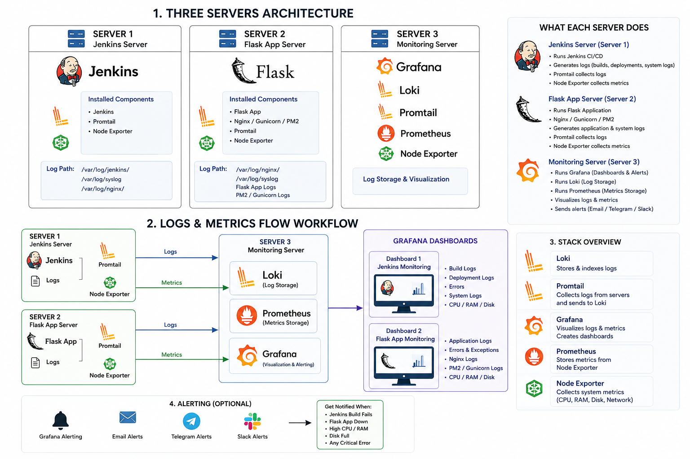.
## Technology Stack

| Category        | Tool                       | Version   |
|-----------------|----------------------------|-----------|
| CI/CD           | Jenkins                    | LTS       |
| App Framework   | Flask + Gunicorn           | Latest    |
| Reverse Proxy   | NGINX                      | Latest    |
| Metrics DB      | Prometheus                 | v3.4.2    |
| Log Aggregation | Loki                       | v3.0.0    |
| Log Shipper     | Promtail                   | v3.0.0    |
| Metrics Agent   | Node Exporter              | v1.9.1    |
| Visualization   | Grafana Enterprise         | v12.0.1   |
| Runtime         | Java 17 (Corretto)         | 17        |
| OS — Server 1   | Amazon Linux 2             | —         |
| OS — Server 2,3 | Ubuntu 24.04               | —         |
| Cloud           | AWS EC2                    | —         |

---

## Server Roles

| Server   | Role                  | Tools Installed                                      |
|----------|-----------------------|------------------------------------------------------|
| Server 1 | CI/CD Server          | Jenkins, Node Exporter, Promtail                     |
| Server 2 | Application Server    | Flask, Gunicorn, NGINX, Node Exporter, Promtail      |
| Server 3 | Central Monitoring    | Prometheus, Loki, Grafana                            |

---

## Prerequisites

Before starting, launch three EC2 instances on AWS and open the required ports in each Security Group.

---

## AWS Security Group Rules

| Server   | Port | Protocol | Purpose                         |
|----------|------|----------|---------------------------------|
| Server 1 | 8080 | TCP      | Jenkins Web UI                  |
| Server 1 | 9100 | TCP      | Node Exporter — Prometheus scrape |
| Server 2 | 80   | TCP      | NGINX / Flask HTTP              |
| Server 2 | 9100 | TCP      | Node Exporter — Prometheus scrape |
| Server 3 | 3000 | TCP      | Grafana Web UI                  |
| Server 3 | 9090 | TCP      | Prometheus Web UI               |
| Server 3 | 3100 | TCP      | Loki — Promtail log push        |

---

## Phase 1 — Server 1 Setup: Jenkins + Node Exporter + Promtail

### Objective

Set up the CI/CD server with Jenkins, install Node Exporter to expose infrastructure metrics, and install Promtail to ship logs to Loki.

---
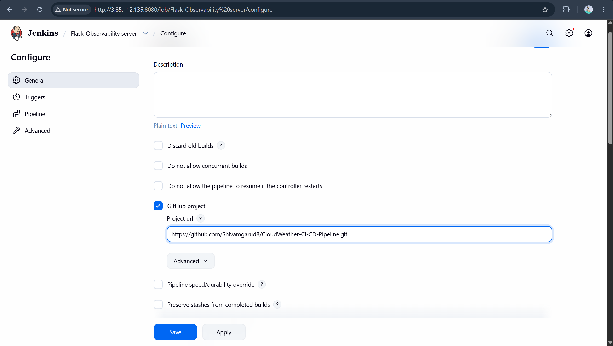.
.
### Step 1 — Launch EC2 Instance for Server 1

Launch an Amazon Linux 2 EC2 instance on AWS. Open ports 8080 and 9100 in the Security Group.

SSH into Server 1 using your key pair.


---

### Step 2 — Install Java and Jenkins

Update the system and add the Jenkins YUM repository. Install Java 17 (Amazon Corretto) as the Jenkins runtime, then install and start Jenkins as a systemd service.

Jenkins runs on port 8080.

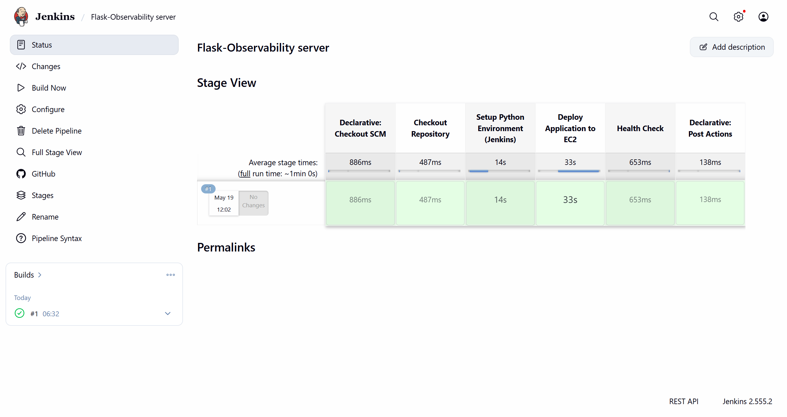.
---

### Step 3 — Unlock Jenkins

Open `http://SERVER1-IP:8080` in the browser. Jenkins asks for the initial admin password on first launch.

Retrieve it from the server and paste it in the browser to complete setup.


---

### Step  — Install Node Exporter

Download Node Exporter v1.9.1 into `/tmp`, extract it, and register it as a systemd service so it starts automatically on boot.

Node Exporter runs on port 9100 and exposes CPU, RAM, disk, and network metrics in Prometheus format.

Verify it is running:

```bash
curl localhost:9100/metrics
```


---

### Step 6 — Install Promtail

Download Promtail v3.0.0 into `/tmp` and make it executable.

Create a config file pointing to the Loki URL on Server 3 at port 3100, and set the log path to `/var/log/jenkins/` with the job label `jenkins`.

Register as a systemd service and start it. Promtail now continuously ships Jenkins logs to Loki.

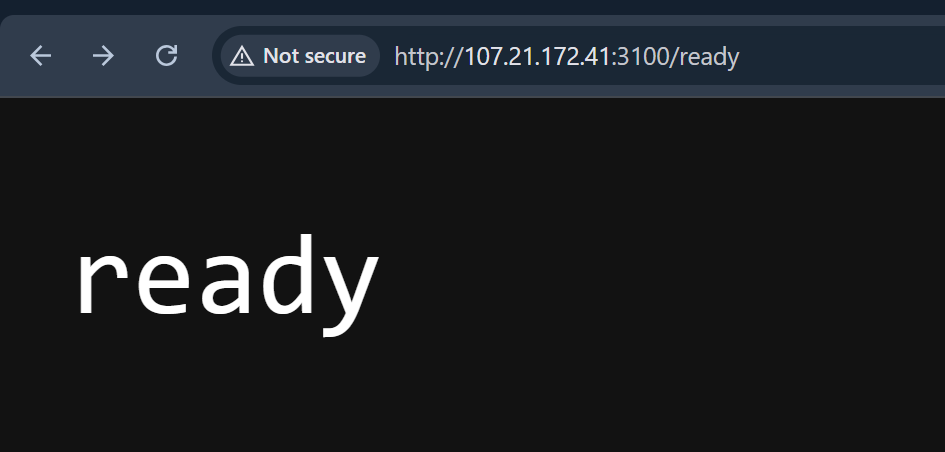.
---

Run the installation script:

```bash
bash install-server1.sh
```

---

## Phase 2 — Server 2 Setup: Flask + NGINX + Node Exporter + Promtail

### Objective

Deploy the Flask Python application behind NGINX, install Node Exporter for metrics, and Promtail to ship application and NGINX logs.

---

### Step 1 — Launch EC2 Instance for Server 2

Launch an Ubuntu 24.04 EC2 instance. Open ports 80 and 9100 in the Security Group.

SSH into Server 2.

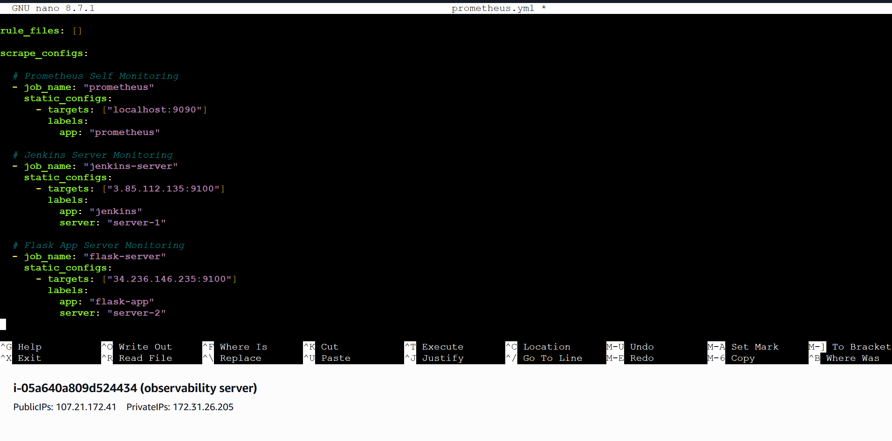.

---

### Step 2 — Install Python and Flask

Install Python 3 and pip, then install Flask and Gunicorn as the WSGI server.

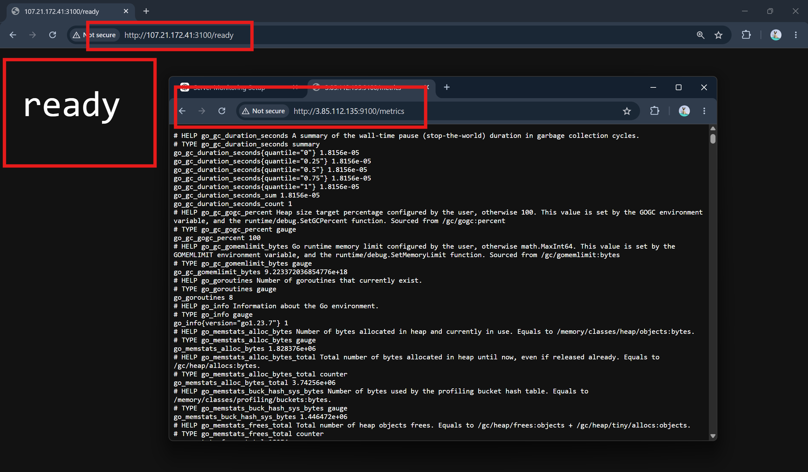.

---


### Step 5 — Install Node Exporter

Same process as Server 1. Download, extract, create systemd service, and start.

Verify:

```bash
curl localhost:9100/metrics
```


---


---

Run the installation script:

```bash
bash install-server2.sh
```

---

## Phase 3 — Server 3 Setup: Prometheus + Loki + Grafana

### Objective

Set up the central monitoring server. Prometheus scrapes metrics from Server 1 and Server 2. Loki receives logs from both Promtails. Grafana visualizes everything and manages alerts.

---

### Step 1 — Launch EC2 Instance for Server 3

Launch an Ubuntu 24.04 EC2 instance. Open ports 3000, 9090, and 3100 in the Security Group.

SSH into Server 3.


---

### Step 2 — Install Prometheus

Download Prometheus v3.4.2 into `/tmp` and extract it.

Edit `prometheus.yml` to add three scrape targets — Prometheus itself, Jenkins Server (Server 1 IP on port 9100), and Flask Server (Server 2 IP on port 9100). Each target gets a human-readable instance label.

Register as a systemd service and start it on port 9090.


---

### Step 3 — Verify Prometheus Targets

Open `http://SERVER3-IP:9090/targets` in the browser.

All three targets — `prometheus`, `jenkins-server`, and `flask-server` — must show status `UP` before dashboards will show data.


---

### Step 4 — Install Loki

Download Loki v3.0.0 into `/tmp`, unzip, and make it executable.

Create a `loki-config.yaml` with local filesystem storage. Register as a systemd service and start it on port 3100.

Loki is now ready to receive log streams from Promtail on Server 1 and Server 2.


---

### Step 5 — Install Grafana

Install the Grafana Enterprise `.deb` package, enable the service, and start it.

Open `http://SERVER3-IP:3000` in the browser. Default login is `admin` / `admin`.


---

### Step 6 — Grafana Home Dashboard

After logging in, the Grafana home screen appears. Datasources and dashboards are configured in the next phase.


---

Run the installation script:

```bash
bash install-server3.sh
```

---

## Phase 4 — Grafana Datasource Configuration

### Objective

Connect Grafana to Prometheus and Loki so dashboards can read metrics and logs.

---

### Step 1 — Add Prometheus Datasource

In Grafana navigate to `Connections → Data Sources → Add new datasource → Prometheus`.

Set the URL to `http://localhost:9090` and click Save & Test.


---

### Step 2 — Add Loki Datasource

In Grafana navigate to `Connections → Data Sources → Add new datasource → Loki`.

Set the URL to `http://localhost:3100` and click Save & Test.


---

### Step 3 — Verify Prometheus Targets

Open `http://SERVER3-IP:9090/targets`. All three targets — `prometheus`, `jenkins-server`, and `flask-server` — must show `UP` before dashboards show any data.


---

## Phase 5 — Grafana Dashboard Setup

### Objective

Import pre-built dashboards to visualize server metrics and explore logs.

---

### Step 1 — Import Server Monitoring Dashboard

In Grafana navigate to `Dashboards → Import`. Enter Dashboard ID `1860` and select the Prometheus datasource.

This gives CPU, RAM, disk, network, and uptime panels. Import once for Jenkins Server and once for Flask Server.


---

### Step 2 — Jenkins Server Dashboard

After import, the Jenkins Server monitoring dashboard shows live CPU, RAM, disk, and network panels.


---

### Step 3 — Flask Server Dashboard

Same dashboard imported again for Flask Server. All panels show Flask server metrics.


---

### Step 4 — Create Log Dashboard

Create a new dashboard and add a Logs panel with Loki as the datasource.

| Purpose                  | LogQL Query                          |
|--------------------------|--------------------------------------|
| All Jenkins logs         | `{job="jenkins"}`                    |
| All Flask logs           | `{job="flask-app"}`                  |
| Flask errors only        | `{job="flask-app"} \|= "ERROR"`      |
| Jenkins build failures   | `{job="jenkins"} \|= "FAILED"`       |
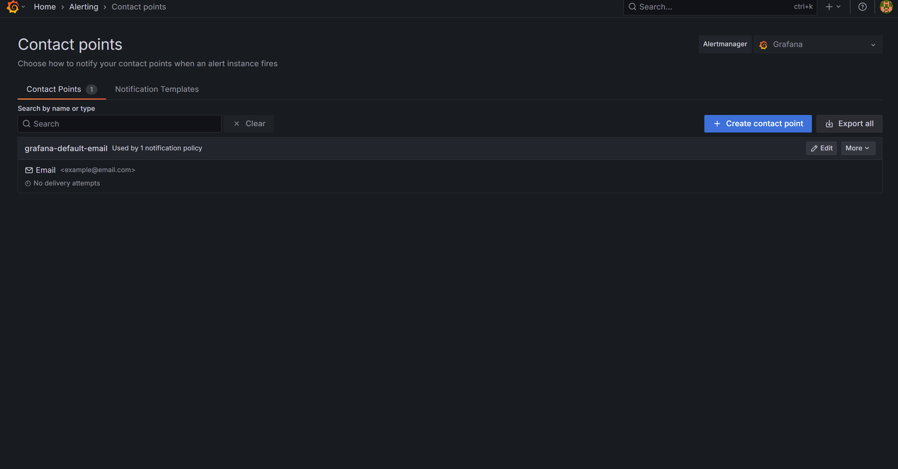.

---

## Phase 6 — Gmail SMTP Setup for Email Alerts

### Objective

Configure Grafana to send alert notifications via Gmail.

---

### Step 1 — Create Gmail App Password

Go to `myaccount.google.com/security` and enable 2-Step Verification. Then open App Passwords, create a new entry named Grafana, and copy the 16-character password Google generates.


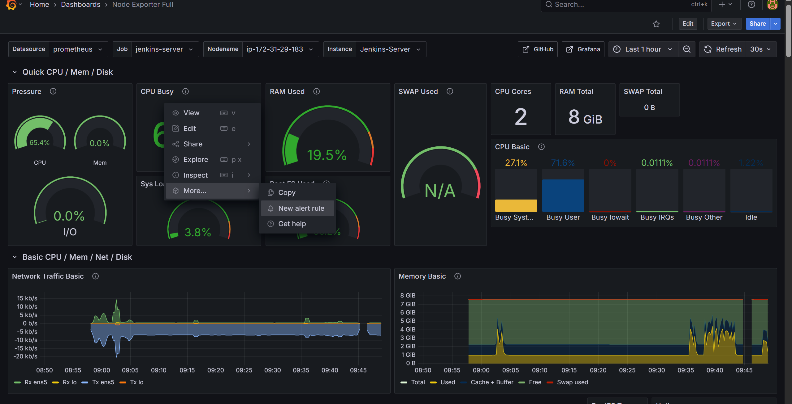.
---

### Step 2 — Edit Grafana SMTP Config

On Server 3 open `/etc/grafana/grafana.ini` and find the `[smtp]` section.

Remove the semicolons from every line — they are comment characters that silently disable each setting. Fill in your Gmail address, App Password, and set the host to `smtp.gmail.com:587`. Restart Grafana after saving.


---

### Step 3 — Add Contact Point

In Grafana navigate to `Alerts & IRM → Contact Points → Add Contact Point`. Choose Email and enter your destination address. Save and click Test.

A test email should arrive within seconds. If it does not, check for remaining semicolons in `grafana.ini` and confirm the App Password is correct.


---

### Step 4 — Test Email Received

Confirm the test alert email arrives in your inbox. The email comes from Grafana Alerts with the subject line `[FIRING] TestAlert`.


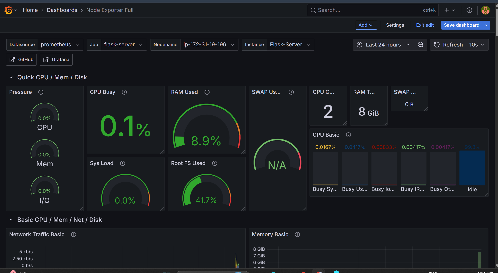.
---

## Phase 7 — Alert Rules Setup

### Objective

Create alert rules in Grafana that fire email notifications when thresholds are breached.

---

### Alert Rule Requirements

Every alert rule needs these four settings or no email will be sent:

| Setting          | Value                 | Why                                              |
|------------------|-----------------------|--------------------------------------------------|
| Folder           | Infrastructure Alerts | Must exist before saving — create it first       |
| Evaluation Group | server-alerts, 1m     | Determines how often the rule is checked         |
| Pending Period   | 1m                    | Threshold must breach continuously for 1 minute  |
| Contact Point    | grafana-default-email | Must be selected — empty means no notification   |

---

### Step 1 — Create Folder and Evaluation Group

In Grafana navigate to `Alerts & IRM → Alert Rules → New Alert Rule`.

Create a new folder named `Infrastructure Alerts` and a new evaluation group named `server-alerts` with interval `1m`.

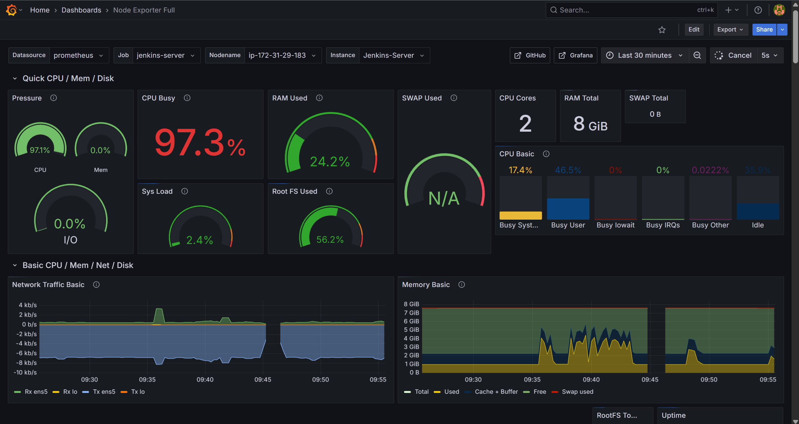.
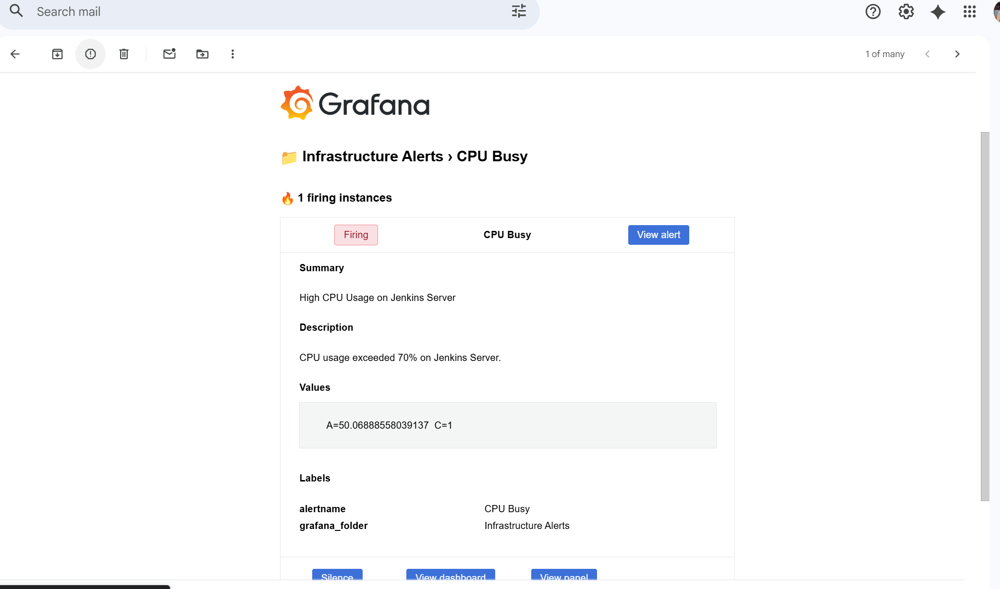.

---

---

### Alert Summary

| Alert       | Condition   | Pending Period | Contact Point         |
|-------------|-------------|----------------|-----------------------|
| CPU High    | above 70%   | 1 minute       | grafana-default-email |
| RAM High    | above 85%   | 1 minute       | grafana-default-email |
| Disk Full   | above 90%   | 1 minute       | grafana-default-email |
| Server Down | up == 0     | None           | grafana-default-email |

---

## Port Reference

| Service       | Port | Server   |
|---------------|------|----------|
| Jenkins       | 8080 | Server 1 |
| Node Exporter | 9100 | Server 1 |
| Flask App     | 5000 | Server 2 |
| NGINX         | 80   | Server 2 |
| Node Exporter | 9100 | Server 2 |
| Prometheus    | 9090 | Server 3 |
| Loki          | 3100 | Server 3 |
| Grafana       | 3000 | Server 3 |

---

## What Gets Monitored

### Infrastructure Metrics — Prometheus + Node Exporter
- CPU utilization per server
- RAM and memory availability
- Disk usage and I/O
- Network traffic
- Server uptime

### Application Logs — Loki + Promtail
- Jenkins build and deployment logs
- Flask application logs
- NGINX access and error logs
- Python error traces

### Alerts — Grafana
- CPU above 70%
- RAM above 85%
- Disk above 90%
- Server unreachable

---

## Grafana Dashboards

| Dashboard                  | Datasource  | Import ID |
|----------------------------|-------------|-----------|
| Jenkins Server Monitoring  | Prometheus  | 1860      |
| Flask Server Monitoring    | Prometheus  | 1860      |
| Jenkins Application Logs   | Loki        | Custom    |
| Flask Application Logs     | Loki        | Custom    |

---

## Production Best Practices Implemented

- All services running as systemd services with auto-restart
- Separate servers for CI/CD, application, and monitoring
- Custom Prometheus labels for human-readable dashboard filtering
- Alert pending periods to prevent false positive notifications
- Gmail App Password for secure SMTP — no main account password used
- LogQL queries filtering errors and failures for fast triage
- Node Exporter on every server for complete infrastructure coverage

---

## Key Learnings

- Deploying a multi-server observability stack on AWS EC2
- Configuring Prometheus scrape targets with custom instance labels
- Shipping logs from multiple servers to centralized Loki using Promtail
- Writing PromQL expressions for real CPU, RAM, and disk percentages
- Setting up Gmail SMTP in Grafana and fixing `.ini` comment pitfalls
- Building Grafana alert rules with pending periods and contact point assignment
- Diagnosing Node Exporter DOWN status via Security Groups and Prometheus targets
- Understanding why alerts fire internally but no email is sent without a contact point

---

## Future Enhancements

- AWS SNS for production-grade multi-channel alerting
- Telegram bot integration for instant mobile notifications
- Kubernetes migration using Amazon EKS
- ArgoCD GitOps deployment pipeline
- Trivy container vulnerability scanning in CI/CD
- Multi-region AWS deployment
- Slack alerting integration

---

## Project Files

| File                    | Purpose                                      |
|-------------------------|----------------------------------------------|
| `README.md`             | Project overview and step-by-step guide      |
| `install-server1.sh`    | Automated setup for Jenkins Server           |
| `install-server2.sh`    | Automated setup for Flask App Server         |
| `install-server3.sh`    | Automated setup for Monitoring Server        |

---

---
👩‍🏫 **Guided and Supported by [Trupti Mane Ma’am](https://github.com/iamtruptimane)**  
---

👨‍💻 **Developed By:**  
**Shivam Garud**  
🧠 *DevOps & Cloud Engineer*  
💼 *DevOps Engineer | CI/CD | Docker | Kubernetes | Terraform | Ansible | AWS | Linux | Cloud Automation | Infrastructure as Code!*  
🌐 [GitHub Profile](https://github.com/Shivamgarud8)
🌐 [Medium blog](https://medium.com/@shivam.garud2011)
🌐 [linkedin](www.linkedin.com/in/shivam-garud)
🌐 [portfolio](https://shivam-garud.vercel.app/)
